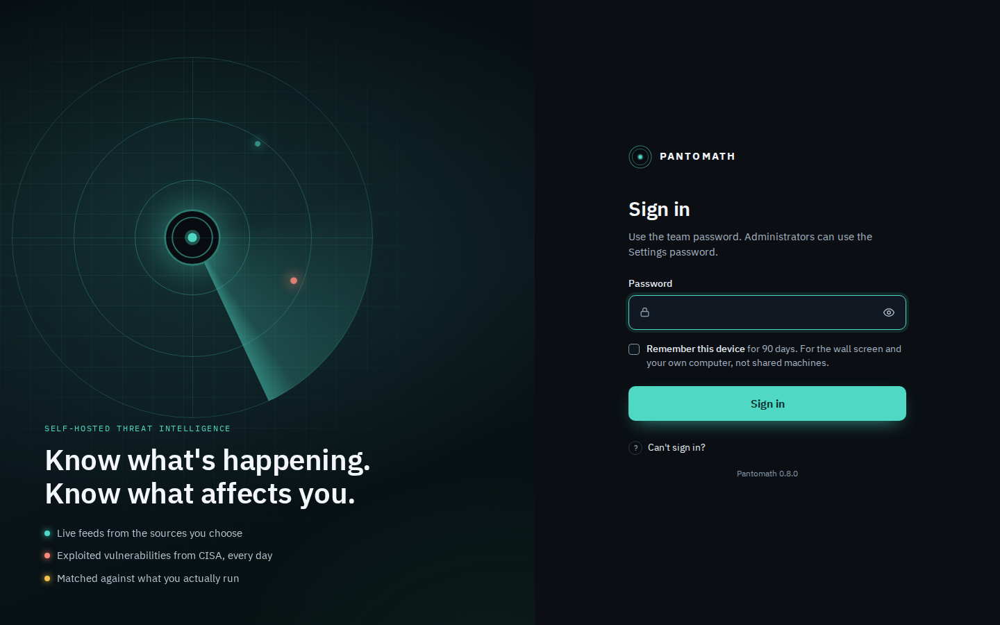
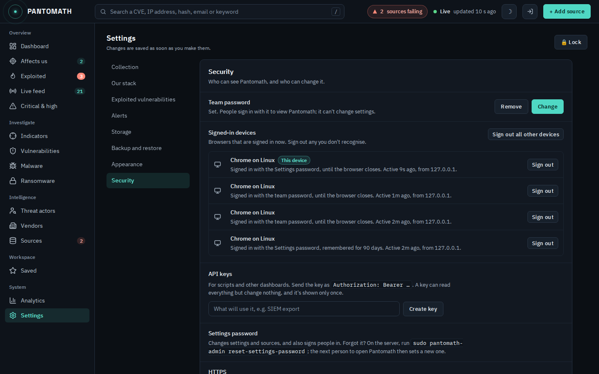
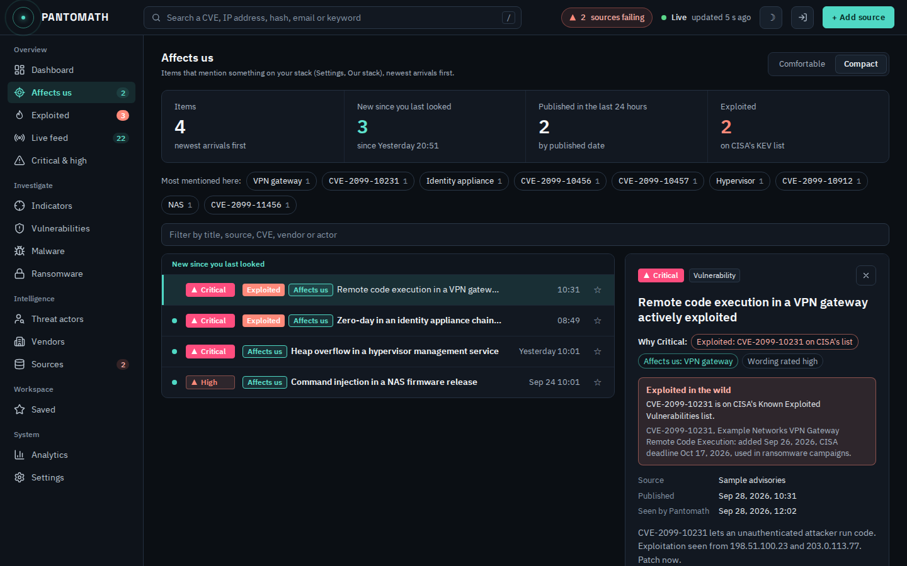
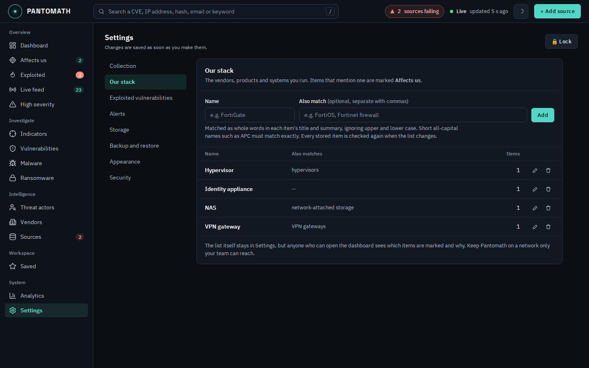
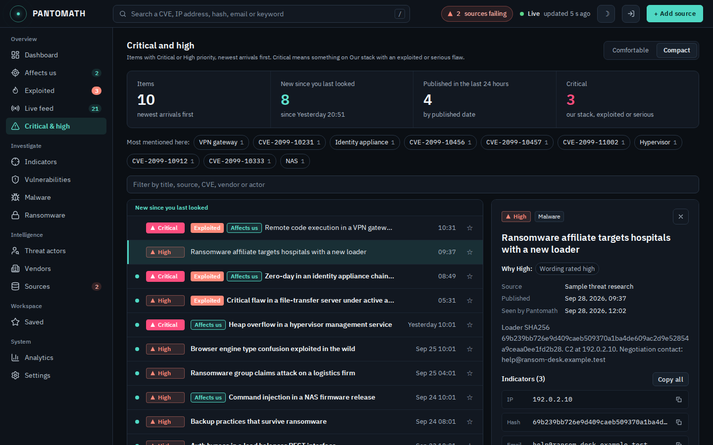
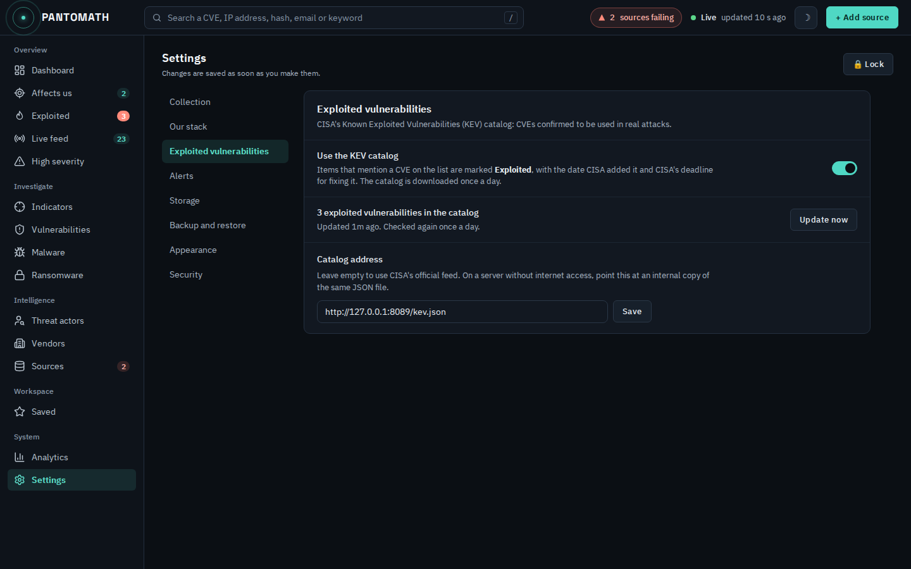

# Pantomath

A lightweight, self-hosted threat intelligence dashboard. Pantomath polls the
RSS and Atom feeds you choose, scores each item's severity, pulls out CVEs,
IP addresses, hashes and emails, tags vendors and threat actors, and shows it
all in one browser dashboard that updates live. Everything stays on your
server: one SQLite file, no cloud service, and it installs and runs without
internet access. Everyone signs in, with a team password to view and a
separate Settings password to change things. **It ships with zero pre-loaded sources**, so a
fresh install shows exactly what you configure.


**Documentation:** [user guide](docs/user-guide.md) ·
[administration](docs/administration.md) ·
[how it works](docs/how-it-works.md) · [API](docs/api.md)

> Screenshots use made-up sample data: no real vendors or incidents, CVE
> numbers in the CVE-2099 range, and IP addresses from the ranges reserved
> for documentation.

## What it does

- **Affects us.** Tell Pantomath what you run (Settings, Our stack: your
  firewalls, switches, hypervisors, UPS and cooling management, remote
  access tools…) and every item that mentions one is marked **Affects us**,
  including items already stored. The dashboard opens with a banner saying
  how many items affect your stack and whether any are being exploited.
- **Exploited.** Pantomath downloads CISA's Known Exploited Vulnerabilities
  catalog once a day and marks every item that mentions a CVE on it as
  **Exploited**, with the date CISA added it, CISA's deadline for fixing
  it, and whether it's been used by ransomware. That's evidence of real
  attacks, not a keyword guess. Webhooks can be limited to items that affect
  your stack, or to exploited vulnerabilities, so alerts stay worth reading.
- **Sign-in.** A team password to view and the Settings password to manage.
  "Remember this device" keeps the wall screen and your own computer signed
  in for 90 days, sign-ins survive restarts, and Settings lists every
  signed-in device so you can sign any of them out. API keys let scripts
  read the data.
- **Dashboard.** What needs attention now: Critical and High items by published
  date, what's new since you last looked, indicators found this week,
  source health with the actual error for any failing feed, and a per-day
  chart. Switch between 24 hours, 7, 30 and 90 days.
- **Live feed.** A dense list you can filter by keyword, severity, source,
  category and date, with a detail panel for the selected item: its
  indicators with copy buttons, related items that share an indicator, and
  one click through to everything else that mentions it. New items are marked
  until you open them (or press Mark all as read); the counts update as you
  read, in every open tab. Keyboard: `J`/`K` move, `O` opens the
  original, `S` saves, `Esc` closes the panel.
- **Indicators.** Every extracted CVE, IP address, hash and email with how
  often it was mentioned, by how many sources, the highest severity it
  appeared with, and when it was first and last seen. Select some or all,
  then copy them, export a CSV, or download a plain-text blocklist for your
  firewall or EDR. The activity calendar narrows everything to one day.
- **Sources.** Health at a glance: healthy and failing counts, last
  successful poll, items today, response time, and *why* a feed is failing
  ("HTTP 404 Not Found", "URL returned a web page, not an RSS/Atom feed",
  "no response from the server within 15s"). Test a feed before saving it.
- **Analytics.** Items published per day by severity, the severity mix
  compared with the previous period, top sources, when items get published
  (weekday by hour), the most mentioned vendors and threat actors,
  categories and indicator counts, over 7, 30 or 90 days or 12 months.
- **Settings** are split into sections (Collection, Our stack, Exploited
  vulnerabilities, Alerts, Storage, Backup and restore, Appearance,
  Security), one at a time.
- **Search.** The search box in the header takes a CVE, IP address, hash or
  email straight to it; anything else filters the Live feed. Press `/` to
  jump to it.
- **Wall screens.** The header shows **Not updating** in red if no data has
  arrived for two minutes, so a frozen screen never looks like a quiet day.
- **High severity, Vulnerabilities, Malware, Ransomware, Saved, Vendors and
  Threat actors** all use the Live feed's list and detail panel, with a
  summary (new since you last looked, last 24 hours, high severity) and the
  CVEs, vendors and actors most mentioned on that page, one click away.
- **Also:** webhook alerts, browser notifications, light and dark themes, a
  phone layout, backup and restore, and an optional retention limit.

## Screenshots

| | |
|---|---|
|  |  |
| **Live feed.** Dense list, unread markers, detail panel. | **Indicators.** Table, selection and export, drill-down, calendar. |
|  |  |
| **Sources.** Health, last success, response time, why a feed fails. | **Add source.** Test the feed before saving. |
|  |  |
| **Sign-in.** Team password to view, Settings password to manage. | **Settings, Security.** Team password, signed-in devices, API keys. |
|  |  |
| **Affects us.** Critical items, with the reasons for their priority. | **Settings, Our stack.** What you run, and how many items mention each. |
|  |  |
| **Critical and high.** Same list and panel as the Live feed, plus what's most mentioned. | **Settings, Exploited vulnerabilities.** CISA's catalog, updated daily. |
|  |  |
| **Analytics.** Volume, severity mix, top sources, publishing times. | **Light theme.** |


## How items are rated

Every item gets a **priority**: Critical, High, Medium or Low. Pantomath works
it out itself (`pantomath/intelligence/priority.py`); nothing is sent to an
outside service. Three signals go in:

- **Wording.** The title and summary, plus the full article page when deep
  extraction is on, are searched as whole words (`scoring.py`). Serious flaw
  words: ransomware, zero-day, 0-day, RCE, remote code execution, "actively
  exploited", "exploited in the wild", "under active exploitation", "critical
  vulnerability", "critical flaw", "critical bug", "critical severity".
  Vulnerability words: a CVE number, vulnerability, APT, breach, malware,
  phishing, backdoor, supply chain, data leak. Plurals and past tense count.
- **Exploited.** One of its CVEs is on CISA's Known Exploited
  Vulnerabilities catalog.
- **Affects us.** It names something on Our stack.

| | Doesn't mention our stack | Mentions our stack |
|---|---|---|
| Exploited (on CISA's list) | High | **Critical** |
| Wording: serious flaw | High | **Critical** |
| Wording: vulnerability words | Medium | High |
| Anything else | Low | Medium |

So anything exploited is at least High, mentioning your stack raises an item
one level, and Critical always means *something you run, with confirmed
exploitation or a serious flaw*. Every item shows why it got its priority
("Exploited: CVE-… on CISA's list", "Affects us: FortiGate", "Wording:
mentions “zero-day”"). Priorities are worked out again automatically when Our
stack or the catalog changes. To change the wording rules, edit the lists in
`scoring.py`, then Settings, Storage, Reprocess all.

## Requirements

- Linux on x86_64 with systemd. The Debian/Ubuntu package is built and
  tested on Ubuntu 24.04. An RPM spec is included but untested (see
  Known limitations).
- Python 3.10 to 3.14 with `venv` (on Debian/Ubuntu: `python3-venv`). The
  package bundles wheels for exactly these versions so it installs offline.
- nginx only if you want HTTPS through `pantomath-admin setup-https`, which
  installs it for you.

## Install

Build the package from the repository, then install it:

```bash
sudo apt install python3-venv git
git clone https://github.com/dzidulajubilee/Pantomath.git
cd Pantomath
./build.sh deb                                  # -> dist/pantomath_<version>_amd64.deb
sudo apt install ./dist/pantomath_*_amd64.deb
```

Use `apt install ./…`, not `dpkg -i`: only `apt` fetches the package's
dependencies (such as `python3-venv`). With `dpkg -i` on a fresh server the
package is left half-installed; if that happens, run `sudo apt install -f`.

`build.sh` reads the version with Python 3.11's `tomllib`. On Python 3.10
(Ubuntu 22.04), pass it yourself: `VERSION=0.6.0 ./build.sh deb`.

If you copy a ready-made `.deb` onto a server instead, check its
`sha256sum` against the published one first. A truncated download fails
halfway through unpacking.

The installer:
- prints a one-time **setup code** at the end: the first-run page needs it
  (see First steps)
- creates a dedicated unprivileged `pantomath` system user
- sets up an isolated Python venv under `/opt/pantomath/venv` from the bundled wheels
- installs, enables and starts the `pantomath` systemd service

## First steps

1. *Recommended:* `sudo pantomath-admin setup-https`, so the first password
   is never sent over plain HTTP (see Security notes).
2. Open `http://<server>:7373`. The **Welcome to Pantomath** page asks for
   the **setup code** printed at the end of the installation (show it again
   with `sudo pantomath-admin setup-code`) and a new **Settings password**.
   Without the code nobody else on the network can claim a fresh install.
3. Save the **recovery code** it shows once: it resets the Settings password
   from the sign-in page if the password is ever lost.
4. In **Settings, Security**, set a **team password** for everyone who only
   needs to view Pantomath. On the wall screen, sign in with it and tick
   "Remember this device".
5. In **Settings, Our stack**, list what you run; check **Settings, Exploited
   vulnerabilities** downloaded CISA's catalog.
6. Click **+ Add source**, paste an RSS or Atom URL, **Test feed**, then
   **Add source**. Polling starts immediately.

The [user guide](docs/user-guide.md) covers every page; the
[administration guide](docs/administration.md) covers running the server.

## Security notes

- **Everyone signs in.** The team password lets people view; the Settings
  password also signs people in and is still needed to change settings and
  sources. The two can't be the same. Only the sign-in page itself loads
  without a session; every data endpoint and the live WebSocket refuse
  signed-out requests.
- Sign-ins are stored in the database as hashes (never the token itself), in
  an HttpOnly, SameSite=Strict cookie that's also marked Secure over HTTPS.
  "Remember this device" lasts 90 days since last use; otherwise a sign-in
  ends when the browser closes or after 12 idle hours. Repeated wrong
  passwords lock out that address for a minute.
- **Settings, Security** lists signed-in devices (sign out any of them, or
  all others at once) and creates **API keys** for scripts
  (`Authorization: Bearer …`). A key can read everything but change nothing.
  Changing the team password signs out everyone who used the old one.
- Pantomath listens on **all interfaces, port 7373**, and over plain HTTP
  passwords cross the network readable. On anything but a trusted network,
  run `sudo pantomath-admin setup-https` to put nginx with a self-signed
  certificate in front of it (it can also bind Pantomath to localhost only).
- Feed URLs never appear in the viewer parts of the API, because they
  sometimes contain API keys. The Our stack list is only available in
  Settings; items show which entry they matched.
- Pantomath downloads CISA's catalog from `www.cisa.gov` once a day. Turn
  that off, or point it at an internal copy, under Settings, Exploited
  vulnerabilities.
- **First run** needs the one-time setup code from the server, so nobody else
  on the network can claim a fresh install. It's stored as a hash (plus a
  file only the service user and root can read) and deleted once used.
- **Forgot the Settings password:** use the recovery code on the sign-in page
  ("Forgot the Settings password?"), or on the server run
  `sudo pantomath-admin reset-settings-password`, which asks for the new
  password in the terminal. Either way, devices signed in with the old
  password are signed out.
- **Lost device or leaked password:** `sudo pantomath-admin sign-out-everyone`
  (add `--api-keys` to revoke API keys too), then change the passwords.
- Already behind an authenticating reverse proxy (SSO)? Set
  `PANTOMATH_OPEN_DASHBOARD=1` in the service environment to turn Pantomath's
  own sign-in off.

## Configuration

Almost everything is managed in the UI:

- **Sources**: add (with a feed test), edit, pause, resume and remove; export
  and import the list as JSON; **Refresh all now** polls every enabled
  source immediately.
- **Deep extraction** (Settings, on by default) fetches each new article's
  full page, not just the RSS teaser, because real indicators are rarely in
  the summary.
- **Webhook alerts** (Settings): a POST to any URL when a new item matches a
  keyword, a source and/or a minimum severity, with a test button.
- **Desktop notifications** (Settings): browser notifications above a
  severity you choose, while a dashboard tab is open.
- **Retention** (Settings): nothing is deleted unless you set a limit.
- **Reprocess stored items** (Settings): re-runs severity scoring, tagging and
  indicator extraction on everything already stored, without re-fetching.
- **Backup and restore** (Settings): download the SQLite file, or restore one.

Data lives in `/var/lib/pantomath/pantomath.db`. Source icons are fetched once
and cached next to it.

To change the port:

```bash
sudo systemctl edit pantomath.service
# [Service]
# Environment=PANTOMATH_PORT=8080
sudo systemctl restart pantomath
```

Want a starter set of feeds on a fresh install (for example, for a fleet of
servers)? Add them to `config/feeds.json` before building the package. It is
only read when the database has no sources at all.

## Upgrading

Install the new package over the old one with `sudo apt install ./pantomath_<version>_amd64.deb`. Your data and
settings are kept, and any database changes are applied automatically when
the service starts. Then:

1. **Settings, Storage, Reprocess all**, if the new version improves detection
   (0.4.5 fixed tagging and severity scoring; 0.8.0 tightened the wording
   rules). Items stored earlier keep their old rating until you do this.
2. **Hard-refresh** the browser once (Ctrl+Shift+R).
3. **Upgrading to 0.8.0 turns on sign-in.** Sign in with the Settings
   password, then set a team password in Settings, Security and sign the wall
   screen in with "Remember this device".
4. **0.8.1**: nothing to do, unless the install never had a Settings
   password (then use `sudo pantomath-admin setup-code`).

## Operating

```bash
sudo systemctl status pantomath
sudo systemctl restart pantomath
sudo journalctl -u pantomath -f
```

Admin commands (run on the server):

```bash
sudo pantomath-admin setup-code                 # the one-time first-run code
sudo pantomath-admin reset-settings-password    # set a new Settings password here
sudo pantomath-admin sign-out-everyone          # end every sign-in (--api-keys: keys too)
sudo pantomath-admin setup-https                # nginx with HTTPS in front
```

Uninstall but keep data: `sudo apt remove pantomath`. Remove everything,
including data: `sudo apt purge pantomath`.

## Building and development

```bash
./build.sh deb        # Debian/Ubuntu package, needs only dpkg-deb
./build.sh rpm        # RPM, needs nfpm (https://nfpm.goreleaser.com/)

make dev              # venv/ with an editable install and dev tools
source venv/bin/activate
make run              # http://localhost:7373, data in ./data/
make test             # the pytest suite
```

How it fits together, and why things are the way they are:
[`docs/ARCHITECTURE.md`](docs/ARCHITECTURE.md). Contributor guide:
[`CONTRIBUTING.md`](CONTRIBUTING.md).

## Known limitations

- **Severity** is a keyword heuristic for triage, not CVSS or EPSS. Keywords
  live in `pantomath/intelligence/scoring.py`.
- **Vendor and threat-actor tags** come from curated name lists
  (`pantomath/intelligence/tagging.py`), and indicators are pattern-matched.
  Both are fast and predictable, but they aren't NLP.
- **Our stack** matches names in each item's title and summary only, not the
  full article page, so an article that mentions your product only deep in
  the text isn't marked. Vendor names are reliable; exact product versions
  are not, because articles name them inconsistently.
- **CISA's catalog is deliberately narrow**: a CVE that isn't on it may still
  be exploited, just not confirmed by CISA yet.
- **Read state** ("new since you last looked", opened items, Mark all as read)
  is kept per browser.
- Items stored before 0.8.0 show "Wording rated high" (or medium) instead of
  the exact phrase until they're reprocessed. There are no user accounts.
- **Source health history** (last success, failing since, response time)
  starts recording once you run 0.6.0 or later.
- **RSS only shows recent items.** Pantomath builds up history from the day
  you add a source; it can't fetch what a feed no longer lists.
- **Desktop notifications** only fire while a dashboard tab is open.
  Webhooks work without a browser.
- **RPM:** the spec depends on a `python3-venv` package that RHEL and Fedora
  don't have, and RHEL 9's default Python (3.9) is older than Pantomath
  needs. It hasn't been tested.

## Changelog

**0.8.1** — First-run setup needs a one-time setup code printed by the
installer (`pantomath-admin setup-code` shows it again), so nobody else can
claim a fresh install. "Forgot the Settings password?" on the sign-in page
resets it with the recovery code. `pantomath-admin reset-settings-password`
now sets the new password in the terminal (`--clear` goes back to first-run
setup and signs everyone out), and `sign-out-everyone` is new; admin commands
run as the service user so they can't leave root-owned database files.
Webhook messages say why an item matters (Affects us, Exploited). New
documentation: user guide, administration guide, how it works, API reference.

**0.8.0** — Sign-in for the whole dashboard: team password to view, Settings
password to manage, a sign-in page, sessions stored (hashed) so they survive
restarts, "remember this device" for 90 days, signed-in devices and API keys
in Settings, Security. New priority scale: Critical (our stack plus an
exploited or serious flaw), High, Medium, Low, with the reason shown on every
item; the bare word "critical" no longer rates High. Opening an item marks it
read at once and every "new" count updates without a refresh (Mark as unread
too); the sign-in page no longer counts as a visit.

**0.7.0** — "Our stack": list what you run and every item that mentions it
is marked Affects us, stored items included. CISA's Known Exploited
Vulnerabilities catalog, downloaded daily (or from an internal copy): items
with a CVE on it are marked Exploited, with CISA's dates. New Affects us and
Exploited pages, a dashboard banner, Live feed filters, markers in every
list and the detail panel, and webhook options to alert only on these.
Settings shows one section at a time. README explains how items are rated.

**0.6.1** — High severity, Vulnerabilities, Malware, Ransomware, Saved,
Vendors and Threat actors redesigned on the Live feed's list and detail
panel, with a summary strip, "most mentioned here" and a filter. Settings
redesigned: sections with a side menu, clearer wording, keyboard-accessible
switches. Themed checkboxes, forms and tables (no more white boxes in dark
mode). Indicators: the calendar now counts distinct indicators, the same
unit as the table and the tab counts, so the numbers match (the tooltip
also gives the number of articles); First seen and Last seen are all-time
even when a day is selected; the drill-down lists when Pantomath saw each
article.

**0.6.0** — Redesigned Live feed (dense list, detail panel, unread markers,
source and category filters, keyboard shortcuts), Indicators (table with
mentions, sources, severity and first/last seen; selection, copy, CSV and
blocklist export; "seen alongside"; calendar kept), Sources (health summary,
last success, failing since, response time, per-source feed test) and a
new Analytics page. Feed test before saving a source. Items that arrive in
the same poll are listed newest-published first.

**0.5.0** — New look (IBM Plex Sans, higher contrast, severity shown with
label and shape), grouped navigation with a phone drawer, header search,
failing-source and "Not updating" indicators, new dashboard. Counts follow
each item's published date.

**0.4.5** — Broken feeds now show why they fail instead of "ok"; feed
fetches time out instead of stalling every source; vendor, actor and
severity keywords match whole words ("intelligence" no longer tags Intel,
"source" no longer scores as RCE).
