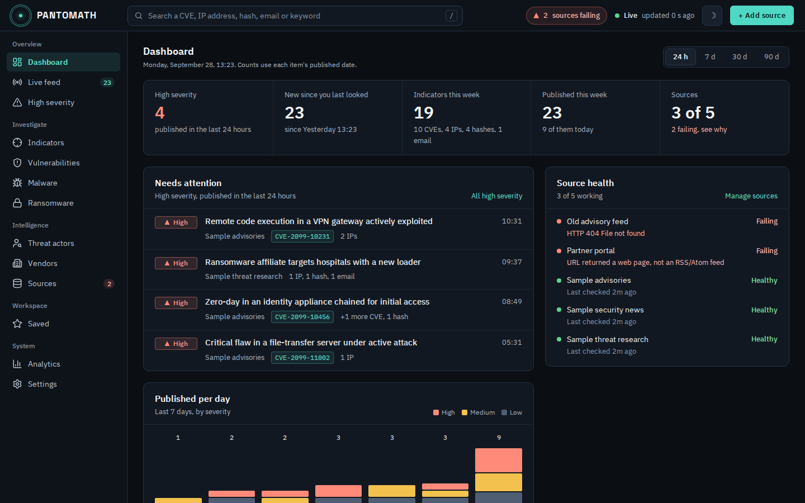
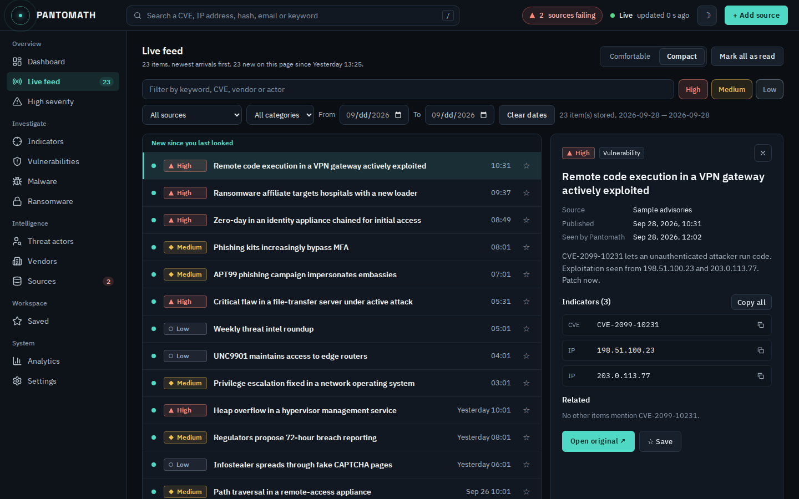
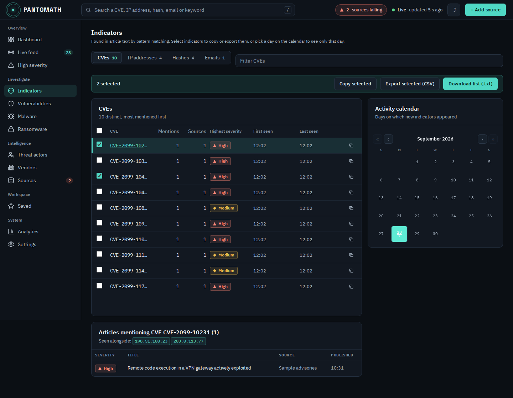
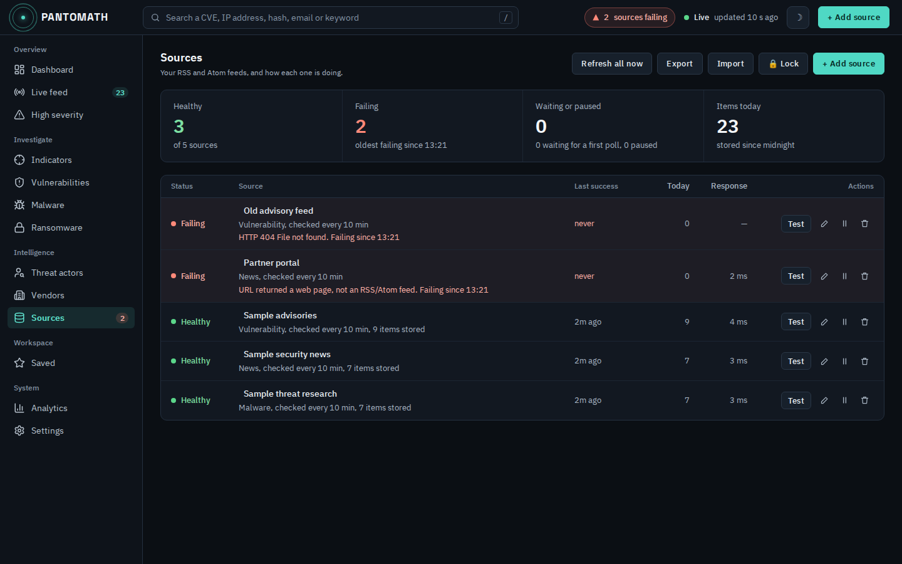
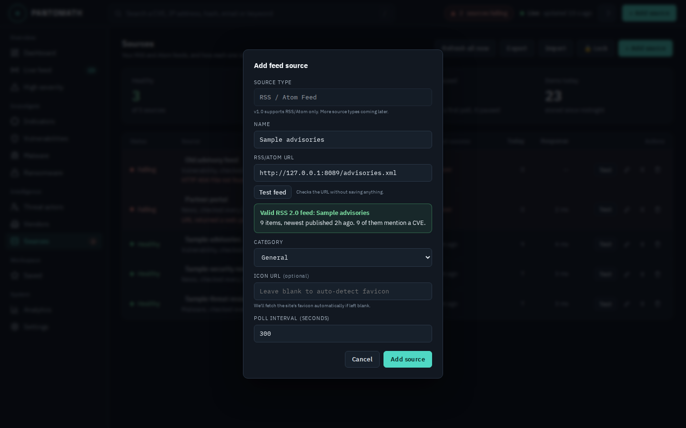
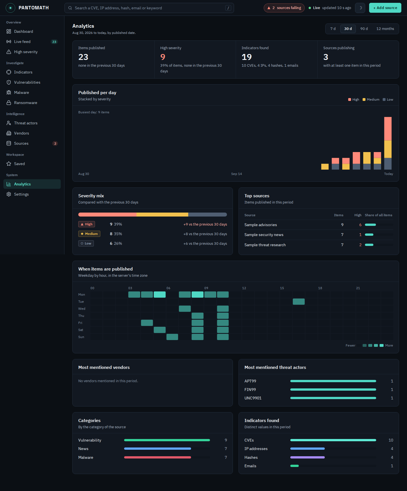
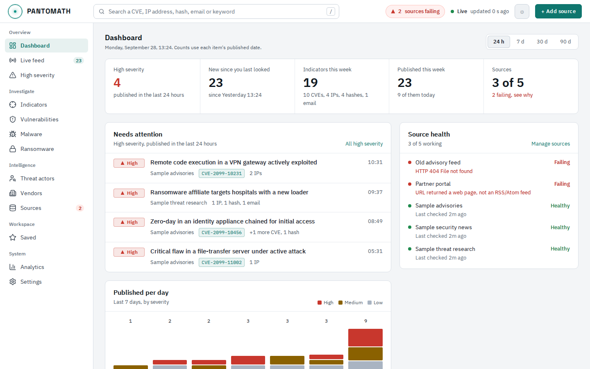
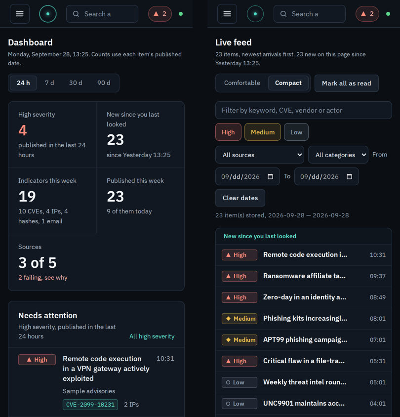

# Pantomath

A lightweight, self-hosted threat intelligence dashboard. Pantomath polls the
RSS and Atom feeds you choose, scores each item's severity, pulls out CVEs,
IP addresses, hashes and emails, tags vendors and threat actors, and shows it
all in one browser dashboard that updates live. Everything stays on your
server: one SQLite file, no cloud service, no accounts, and it installs and
runs without internet access. **It ships with zero pre-loaded sources**, so a
fresh install shows exactly what you configure.



> Screenshots use made-up sample data: no real vendors or incidents, CVE
> numbers in the CVE-2099 range, and IP addresses from the ranges reserved
> for documentation.

## What it does

- **Dashboard.** What needs attention now: high-severity items by published
  date, what's new since you last looked, indicators found this week,
  source health with the actual error for any failing feed, and a per-day
  chart. Switch between 24 hours, 7, 30 and 90 days.
- **Live feed.** A dense list you can filter by keyword, severity, source,
  category and date, with a detail panel for the selected item: its
  indicators with copy buttons, related items that share an indicator, and
  one click through to everything else that mentions it. New items stay
  marked until you mark them read. Keyboard: `J`/`K` move, `O` opens the
  original, `S` saves, `Esc` closes the panel.
- **Indicators.** Every extracted CVE, IP address, hash and email with how
  often it was mentioned, by how many sources, the highest severity it
  appeared with, and when it was first and last seen. Select some or all,
  then copy them, export a CSV, or download a plain-text blocklist for your
  firewall or EDR. The activity calendar narrows everything to one day.
- **Sources.** Health at a glance: healthy and failing counts, last
  successful poll, items today, response time, and *why* a feed is failing
  ("HTTP 404 Not Found", "URL returned a web page, not an RSS/Atom feed",
  "no response from the server within 15s"). Test a feed before saving it.
- **Analytics.** Items published per day by severity, the severity mix
  compared with the previous period, top sources, when items get published
  (weekday by hour), the most mentioned vendors and threat actors,
  categories and indicator counts, over 7, 30 or 90 days or 12 months.
- **Search.** The search box in the header takes a CVE, IP address, hash or
  email straight to it; anything else filters the Live feed. Press `/` to
  jump to it.
- **Wall screens.** The header shows **Not updating** in red if no data has
  arrived for two minutes, so a frozen screen never looks like a quiet day.
- **Also:** High severity, Vulnerabilities, Malware and Ransomware views,
  vendor and threat-actor pages, saved items, webhook alerts, browser
  notifications, light and dark themes, a phone layout, backup and restore,
  and an optional retention limit.

## Screenshots

| | |
|---|---|
|  |  |
| **Live feed.** Dense list, unread markers, detail panel. | **Indicators.** Table, selection and export, drill-down, calendar. |
|  |  |
| **Sources.** Health, last success, response time, why a feed fails. | **Add source.** Test the feed before saving. |
|  |  |
| **Analytics.** Volume, severity mix, top sources, publishing times. | **Light theme.** |



## Requirements

- Linux on x86_64 with systemd. The Debian/Ubuntu package is built and
  tested on Ubuntu 24.04. An RPM spec is included but untested (see
  Known limitations).
- Python 3.10 to 3.13 with `venv` (on Debian/Ubuntu: `python3-venv`). The
  package bundles wheels for exactly these versions so it installs offline.
- nginx only if you want HTTPS through `pantomath-admin setup-https`, which
  installs it for you.


## Requirement

```bash
apt install python3-venv

apt install nginx
```

## Install

Build the package from the repository, then install it:

```bash
sudo apt install python3-venv git
git clone https://github.com/dzidulajubilee/Pantomath.git
cd Pantomath
./build.sh deb                                  # -> dist/pantomath_<version>_amd64.deb
sudo dpkg -i dist/pantomath_*_amd64.deb
```

`build.sh` reads the version with Python 3.11's `tomllib`. On Python 3.10
(Ubuntu 22.04), pass it yourself: `VERSION=0.6.0 ./build.sh deb`.

If you copy a ready-made `.deb` onto a server instead, check its
`sha256sum` against the published one first. A truncated download fails
halfway through unpacking.

The installer:
- creates a dedicated unprivileged `pantomath` system user
- sets up an isolated Python venv under `/opt/pantomath/venv` from the bundled wheels
- installs, enables and starts the `pantomath` systemd service

## First steps

<<<<<<< Updated upstream

=======
1. Open `http://<server>:7373`.
2. Go to **Sources**. The first time, choose a password for Settings and
   Sources. A recovery code is shown once: keep it somewhere safe.
3. Click **+ Add source**, paste an RSS or Atom URL and press **Test feed**.
   If the test passes, click **Add source**. Leave the icon blank and
   Pantomath fetches the site's favicon.
4. Polling starts immediately. The dashboard fills in as items arrive.

## Security notes

- The dashboard, feeds, indicators and analytics can be read **without a
  login** by design, so they can run on a shared or wall screen. Anything
  that changes configuration, or makes the server fetch a URL, needs the
  Settings password.
- Pantomath listens on **all interfaces, port 7373**. Limit access with a
  firewall, or run `sudo pantomath-admin setup-https` to put nginx with a
  self-signed certificate in front of it (it can also bind Pantomath to
  localhost only).
- Feed URLs never appear in the public parts of the API, because they
  sometimes contain API keys.
- Forgot the password: `sudo pantomath-admin reset-settings-password`.
>>>>>>> Stashed changes

## Configuration

Almost everything is managed in the UI:

- **Sources**: add (with a feed test), edit, pause, resume and remove; export
  and import the list as JSON; **Refresh all now** polls every enabled
  source immediately.
- **Deep extraction** (Settings, on by default) fetches each new article's
  full page, not just the RSS teaser, because real indicators are rarely in
  the summary.
- **Webhook alerts** (Settings): a POST to any URL when a new item matches a
  keyword, a source and/or a minimum severity, with a test button.
- **Desktop notifications** (Settings): browser notifications above a
  severity you choose, while a dashboard tab is open.
- **Retention** (Settings): nothing is deleted unless you set a limit.
- **Reprocess stored items** (Settings): re-runs severity scoring, tagging and
  indicator extraction on everything already stored, without re-fetching.
- **Backup and restore** (Settings): download the SQLite file, or restore one.

Data lives in `/var/lib/pantomath/pantomath.db`. Source icons are fetched once
and cached next to it.

To change the port:

```bash
sudo systemctl edit pantomath.service
# [Service]
# Environment=PANTOMATH_PORT=8080
sudo systemctl restart pantomath
```

Want a starter set of feeds on a fresh install (for example, for a fleet of
servers)? Add them to `config/feeds.json` before building the package. It is
only read when the database has no sources at all.

## Upgrading

Install the new package over the old one with `sudo dpkg -i`. Your data and
settings are kept, and any database changes are applied automatically when
the service starts. Then:

1. **Settings → Reprocess all**, if the new version improves detection
   (0.4.5 fixed tagging and severity scoring; items stored earlier keep
   their old tags until you do this).
2. **Hard-refresh** the browser once (Ctrl+Shift+R).

## Operating

```bash
sudo systemctl status pantomath
sudo systemctl restart pantomath
sudo journalctl -u pantomath -f
```

Uninstall but keep data: `sudo apt remove pantomath`. Remove everything,
including data: `sudo apt purge pantomath`.

## Building and development

```bash
./build.sh deb        # Debian/Ubuntu package, needs only dpkg-deb
./build.sh rpm        # RPM, needs nfpm (https://nfpm.goreleaser.com/)

make dev              # venv/ with an editable install and dev tools
source venv/bin/activate
make run              # http://localhost:7373, data in ./data/
make test             # the pytest suite
```

How it fits together, and why things are the way they are:
[`docs/ARCHITECTURE.md`](docs/ARCHITECTURE.md). Contributor guide:
[`CONTRIBUTING.md`](CONTRIBUTING.md).

## Known limitations

- **Severity** is a keyword heuristic for triage, not CVSS or EPSS. Keywords
  live in `pantomath/intelligence/scoring.py`.
- **Vendor and threat-actor tags** come from curated name lists
  (`pantomath/intelligence/tagging.py`), and indicators are pattern-matched.
  Both are fast and predictable, but they aren't NLP.
- **Read state** ("new since you last looked", Mark all as read) is kept per
  browser. There are no user accounts.
- **Source health history** (last success, failing since, response time)
  starts recording once you run 0.6.0 or later.
- **RSS only shows recent items.** Pantomath builds up history from the day
  you add a source; it can't fetch what a feed no longer lists.
- **Desktop notifications** only fire while a dashboard tab is open.
  Webhooks work without a browser.
- **RPM:** the spec depends on a `python3-venv` package that RHEL and Fedora
  don't have, and RHEL 9's default Python (3.9) is older than Pantomath
  needs. It hasn't been tested.

<<<<<<< Updated upstream
```bash
make test    # pytest — 34 tests covering dedup, tagging, connector registry, API behavior
make lint    # ruff check
make fmt     # ruff check --fix + format
```

## Previews

### Dashboard


### Feed Source Management


### IOCs


### Settings


=======
## Changelog

**0.6.0** — Redesigned Live feed (dense list, detail panel, unread markers,
source and category filters, keyboard shortcuts), Indicators (table with
mentions, sources, severity and first/last seen; selection, copy, CSV and
blocklist export; "seen alongside"; calendar kept), Sources (health summary,
last success, failing since, response time, per-source feed test) and a
new Analytics page. Feed test before saving a source. Items that arrive in
the same poll are listed newest-published first.

**0.5.0** — New look (IBM Plex Sans, higher contrast, severity shown with
label and shape), grouped navigation with a phone drawer, header search,
failing-source and "Not updating" indicators, new dashboard. Counts follow
each item's published date.

**0.4.5** — Broken feeds now show why they fail instead of "ok"; feed
fetches time out instead of stalling every source; vendor, actor and
severity keywords match whole words ("intelligence" no longer tags Intel,
"source" no longer scores as RCE).
>>>>>>> Stashed changes
