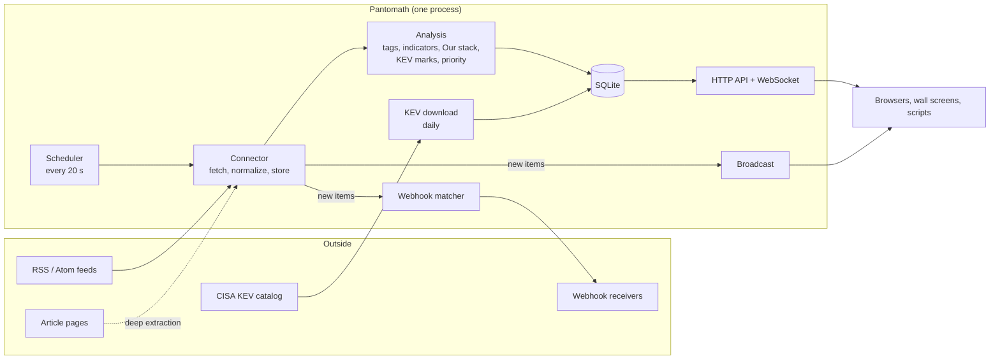

# How Pantomath works

The architecture, the collection pipeline, every rule Pantomath applies, the
data model, the security model and the frontend: everything needed to
understand, operate or change it. For using it see the
[user guide](user-guide.md); for installing and running it see
[administration.md](administration.md); for the HTTP interface see
[api.md](api.md). The reasoning behind individual decisions, and the bugs
that shaped them, are recorded in [ARCHITECTURE.md](ARCHITECTURE.md).

**Contents**

1. [The big picture](#1-the-big-picture)
2. [Code map](#2-code-map)
3. [Collecting items](#3-collecting-items)
4. [The scheduler](#4-the-scheduler)
5. [Analysis rules](#5-analysis-rules)
6. [Dates and counting](#6-dates-and-counting)
7. [Source health](#7-source-health)
8. [Data model](#8-data-model)
9. [The API layer](#9-the-api-layer)
10. [Sign-in and security](#10-sign-in-and-security)
11. [Alerts](#11-alerts)
12. [The frontend](#12-the-frontend)
13. [Packaging](#13-packaging)
14. [Testing](#14-testing)
15. [Extending Pantomath](#15-extending-pantomath)
16. [Limits and trade-offs](#16-limits-and-trade-offs)

---

## 1. The big picture

Pantomath is one Python process (FastAPI on uvicorn) with one SQLite
database and a browser frontend served by the same process. There are no
other services, no build step for the frontend, and no required internet
access.



In words: the **scheduler** checks every enabled source when its interval
has elapsed. Its **connector** fetches the feed, turns each entry into an
item, skips items already stored, and for each new item fetches the
article page (deep extraction), rates the wording, tags vendors and threat
actors, extracts indicators, matches Our stack, marks CISA-listed CVEs and
works out the priority. New items are stored, pushed to open browsers over
the WebSocket, and handed to the webhook matcher. Browsers read everything
else through the HTTP API.

## 2. Code map

```
pantomath/
  app.py                 FastAPI app: startup (database, setup code, scheduler), static files, the page shell
  cli.py                 pantomath-admin: setup-code, reset-settings-password, sign-out-everyone, setup-https
  https_setup.py         nginx + self-signed HTTPS in front of Pantomath
  api/routes.py          every HTTP endpoint, the sign-in gate, the WebSocket
  auth/
    sign_in.py           dashboard sign-in: team password, sessions, API keys, attempt limits
    settings_auth.py     the Settings password, recovery code, Settings tokens
    setup_code.py        the one-time first-run setup code
  connectors/
    base.py              the connector contract: fetch -> normalize -> validate -> store
    registry.py          connector type -> class
    rss.py               the RSS/Atom connector (the only one today)
  feeds/
    rss.py               fetching a feed: limits, timeouts, readable errors
    parser.py            feedparser entry -> flat item dict
    article_fetcher.py   deep extraction: an article page -> plain text
    scheduler.py         polling, retention, the daily KEV download
  intelligence/
    scoring.py           wording rating (High / Medium / Low keywords)
    tagging.py           vendors and threat actors
    ioc_extraction.py    CVEs, IP addresses, hashes, emails
    watchlist.py         Our stack matching
    kev.py               CISA KEV download, storage and marking
    priority.py          Critical / High / Medium / Low, and the reasons
    reprocessor.py       re-running the analysis on stored items
    enrichment.py        source icons
  alerts/
    matcher.py           does a new item match a webhook's rules?
    dispatcher.py        building and sending webhook payloads
    webhook_keys.py      optional per-webhook protection keys; the PBKDF2 helper
  database/
    models.py            schema (plain SQL) and the list of column migrations
    sqlite.py            connections, migrations, one-time backfills
    restore.py           validating and swapping in a backup
frontend/
  pages/dashboard.html   the whole page shell: sign-in page, header, sidebar, every view
  widgets/app.js         the application: router, views, lists, panels, settings, sign-in
  widgets/*.js           calendar, charts, notifications, pagination, theme, legacy card list
  components/icon.js     source icons
  themes/pantomath.css   design tokens and all styles
  assets/                bundled fonts (IBM Plex Sans) and icons; nothing loads from a CDN
config/feeds.json        optional starter sources for new installs (empty by default)
installer/               Debian and RPM scripts, systemd unit, bundled wheels
tests/                   the pytest suite
```

## 3. Collecting items

A connector's `update()` runs four steps: **fetch → normalize → validate →
store**. The RSS connector's steps:

**Fetch** (`feeds/rss.py`). Only `http://` and `https://`. A read that gets
no data for 15 s fails; the whole download may take at most 45 s; more than
10 MB is refused; gzip and deflate are decoded. A backstop in the connector
abandons any fetch still running after about a minute. Failures become
readable messages that the Sources page shows: `HTTP 404 Not Found`,
`could not resolve the host name`, `no response from the server within 15s`,
`URL returned a web page, not an RSS/Atom feed`, and so on. feedparser is
lenient and never raises, so the fetcher checks the result itself: a
document that isn't a feed is an error, not "0 new items".

**Normalize** (`feeds/parser.py`). Each entry becomes a flat item: title,
link, summary, published time (UTC, from the feed's parsed date) and a
GUID: the feed's own ID, else the link, else a SHA-1 of title and link.

**Validate.** An item needs a title and a GUID.

**Store** (`connectors/rss.py`):

1. Items whose (source, GUID) pair is already stored are skipped. The table
   enforces this with `UNIQUE(source_id, guid)`, so an item is stored once,
   and editing a source never duplicates its history.
2. For the remaining items, **deep extraction** (if on): up to 5 article
   pages are fetched at a time, 8 s each, the first 400 KB of each, reduced
   to at most 20,000 characters of text (scripts, styles, navigation,
   headers and footers removed).
3. Analysis (section 5) runs on the title, the summary and the article text
   together, except Our stack, which always uses only the title and summary.
4. The item is inserted with a new random ID. Its analysis results are stored
   with it: the priority, the wording rating and phrase, vendors, actors,
   indicators, Our stack matches and exploited CVEs.

The new items are returned to the scheduler, which broadcasts them and runs
webhooks.

**Reprocessing** (`intelligence/reprocessor.py`, Settings, Storage) re-runs
steps 2–3 on stored items in batches of 200, without re-reading the feeds.

## 4. The scheduler

`feeds/scheduler.py` runs one loop inside the web process. Every 20 seconds
it:

1. checks each **enabled** source and polls those whose interval has elapsed
   since their last check (one after another, each bounded as above);
2. at most once an hour, deletes items older than the retention limit, if one
   is set;
3. at most every five minutes, checks whether CISA's catalog is due: daily
   after a successful download, hourly after a failed one, never when turned
   off. The download runs as a separate task, so it can't delay polling.

For each poll it records on the source: `last_fetched` and `last_status`
(`ok` or `error: <reason>`); on success `last_success` and clearing
`failing_since`; on the first failure `failing_since`, kept until the next
success; and `last_duration_ms`. New items are broadcast to every connected
browser as `{"type": "new_items", "items": [...]}` and passed to the webhook
dispatcher.

**Refresh all now** (Sources) polls every enabled source immediately.

## 5. Analysis rules

Everything is rule-based: regular expressions and curated lists, fast and
predictable, with no outside service. Matching is on **whole words**: a term
must not be preceded or followed by a letter or digit.

### 5.1 Wording rating (`scoring.py`)

The title and text are lower-cased and searched in two passes. The first
phrase found decides the rating, and that phrase is stored.

- **High** if any appears: ransomware, zero-day, 0-day, exploited in the
  wild, actively exploited, under active exploitation, RCE, remote code
  execution, critical vulnerability, critical flaw, critical bug, critical
  severity, critical-severity, critical security flaw / vulnerability / bug.
- **Medium** otherwise, if any appears: a CVE ID, vulnerability, APT, breach,
  malware, phishing, backdoor, supply chain, data leak.
- **Low** otherwise.

Plurals and past tense count (`s`, `es` and `ed` endings). The bare word
*critical* is deliberately not a High word: "critical infrastructure" and
"critical of" made it the biggest source of false alarms.

### 5.2 Priority (`priority.py`)

| | Doesn't mention Our stack | Mentions Our stack |
|---|---|---|
| **Exploited** (a CVE on CISA's catalog) | High | **Critical** |
| Wording: High | High | **Critical** |
| Wording: Medium | Medium | High |
| Wording: Low | Low | Medium |

As a formula: take the wording rating; if exploited, raise it to at least
High; if it mentions Our stack, raise it one level (Critical at most).

The priority is stored in `items.severity`, which every filter, count,
webhook threshold and notification threshold uses. The wording rating and
its phrase are stored separately (`content_severity`, `content_keyword`)
so the priority can be recomputed without re-reading the article. That
happens whenever Our stack changes, the catalog changes, or items are
reprocessed. Items stored before 0.8.0 had their old rating copied across
once at upgrade.

**Reasons**, shown on every item, most important first:
`Exploited: CVE-… on CISA's list`, `Affects us: <entries>`,
`Wording: mentions "<phrase>"` (or `Wording rated high` for items stored
before the phrase was recorded), or `No warning words found`.

### 5.3 Vendors and threat actors (`tagging.py`)

- **Vendors:** a curated list of 42 names. Names that are also ordinary
  words or common in other contexts (Apple, Chrome, Intel, Juniper, Meta,
  Oracle, Play, Zoom) only match with their exact capitalisation; a few have
  extra guards (so "Threat Intel" isn't the vendor Intel).
- **Threat actors:** a curated list of 19 names, plus naming patterns:
  `APT` followed by 1 to 3 digits (with an optional space or dash), `UNC` + 3 to
  5 digits, `FIN` + 1 to 2 digits, `TA` + 3 to 4 digits.

Tags are found in the title and article text. Edit the lists to change
them, then reprocess.

### 5.4 Indicators (`ioc_extraction.py`)

| Type | Rule |
|---|---|
| CVE | `CVE-YYYY-NNNN` with 4 to 7 digits; stored upper case |
| IPv4 | four octets 0–255; `0.0.0.0`, `127.0.0.1`, `255.255.255.255`, `1.1.1.1` and `8.8.8.8` are ignored as noise |
| Hash | 32, 40 or 64 hexadecimal characters (MD5, SHA-1, SHA-256) |
| Email | a normal address pattern; stored lower case so one address isn't counted twice |

Duplicates within an item are removed, keeping first-seen order. There is no
validation against outside services: an IP address in an article is an
indicator *mentioned*, not a verified bad address.

### 5.5 Our stack (`watchlist.py`)

Each entry has a name and optional extra spellings. A term matches as a
whole word or phrase, ignoring case, with any run of whitespace between the
words of a phrase. Short all-capital terms of up to four characters (APC,
NAS) must match exactly, so they don't fire on ordinary words.

Only the **title and the RSS summary** (HTML tags removed) are checked,
never the deep-extraction page. The page isn't stored, so stored items
couldn't be re-checked the same way. And names in a page's sidebar or
"related stories" would mark unrelated items.

When the list changes, every stored item is re-checked in batches of 1,000
rows, and priorities follow.

### 5.6 Exploited (`kev.py`)

CISA's catalog (a public JSON file) is downloaded daily, from CISA or from
the address set in Settings. Each entry keeps the CVE, vendor, product,
name, date added, CISA's due date and whether ransomware campaigns are known
to use it. An item is **Exploited** when any of its CVEs is in the catalog.
After every successful download all items with CVEs are re-marked, in
batches of 2,000. A failed download keeps the previous copy and records the
reason, which Settings shows. Limits: 30 s per network read, 2 minutes in
total, 30 MB.

## 6. Dates and counting

**Two times per item:** `published` (from the feed) and `fetched_at` (when
Pantomath stored it). Feeds publish backlogs and odd dates, so counting uses
an **effective published time**: the published time if it's present and not
more than an hour after the item was fetched, otherwise the fetch time. In
SQL:

```sql
CASE WHEN published > 0 AND published <= fetched_at + 3600 THEN published ELSE fetched_at END
```

| What | Counted by |
|---|---|
| Dashboard figures, Needs attention, Published per day, Analytics | effective published time |
| New since you last looked, Items today (Sources), Indicators calendar, first/last seen | `fetched_at` (when Pantomath saw it) |
| Live feed date filter | the date Pantomath stored the item |
| List order | newest arrival first, by minute; within the same minute, newest published first |

**Time zones.** Day boundaries ("today", calendar days, the analytics
weekday-by-hour chart) are the **server's** local time. Times shown in the
browser are in the browser's time zone.

**New since you last looked** combines three things:

1. a time mark kept in the browser: when you last left Pantomath (a page
   hidden or closed, never the sign-in page), or when you pressed **Mark all
   as read**, whichever is later. A first visit uses the last 24 hours;
2. the server's count of items stored after that mark;
3. two small lists kept in the browser: items opened after the mark
   (subtracted) and items marked unread from before it (added).

So opening an item lowers every "new" count at once, other tabs follow
through the browser's storage events, and nothing about reading is stored
on the server. Read state is therefore per browser, not per person.

**Indicators:** the calendar counts **distinct indicators** of the selected
type seen each day, the same unit as the table and the tab counts for that
day; its tooltip adds the number of articles. In the table, Mentions,
Sources and Highest priority follow the selected day, while First seen and
Last seen are always over all time.

**Analytics** compares each period with the previous one of the same length
(the 30 days before the last 30 days, and so on).

**Not updating:** the header turns red when the browser has received no
data for 120 seconds.

## 7. Source health

| State | Condition |
|---|---|
| Paused | the source is disabled |
| Healthy | the last check succeeded |
| Failing | the last check failed; the reason is the text after `error:` |
| Waiting | enabled but never checked yet |

The Sources page sorts Failing first, then Waiting, Healthy and Paused. The
dashboard's source list and the header pill come from the same states.
Public parts of the API report a source's state and reason but never its
address, because feed addresses sometimes contain API keys.

## 8. Data model

SQLite in WAL mode (readers don't block the writer), with foreign keys on
and a 5-second busy timeout. The schema is plain SQL in
`database/models.py`.

| Table | Holds |
|---|---|
| `sources` | name, url, category, colour, icon URL, connector type, interval, enabled, last check / status / success / failing-since / duration |
| `items` | source, title, link, summary, published, fetched_at, guid, **severity (the priority)**, content_severity, content_keyword, vendors, actors, cves, ips, hashes, emails, watch_hits, kev_cves, bookmarked |
| `settings` | key/value pairs: deep extraction, retention days, KEV switch and address and status, password hashes and salts, lockout counters, setup code hash |
| `webhooks` | name, url, rules (keyword, source, minimum priority, only affects us, only exploited), TLS option, protection key hash, last triggered and status |
| `watchlist` | Our stack: name and extra spellings |
| `kev` | CISA's catalog: cve, vendor, product, name, dates, ransomware use, description |
| `sessions` | sign-ins and API keys: SHA-256 of the token, kind, role, label, remember, created, last seen, expiry, address |

List-like columns (vendors, cves, watch_hits…) are comma-separated strings;
queries split them with a recursive CTE when counting distinct values.
Indexes: `items(fetched_at)`, `items(source_id)`, `items(severity)`.

**Migrations.** New columns are listed in `MIGRATIONS` and added with
`ALTER TABLE` on startup when missing, so any older database, including a
restored backup, is brought up to date automatically. One-time data fixes
(such as the 0.8.0 priority backfill) run right after.

## 9. The API layer

All endpoints are in `api/routes.py`, on three routers:

| Router | Access | Contents |
|---|---|---|
| `auth_router` | anyone | sign-in status, sign in, first-run setup, recovery, sign out, the WebSocket (which checks the cookie itself) |
| `router` | signed in | every data endpoint (items, indicators, overview, analytics, tags, KEV lookups, icons, Settings unlock) |
| `protected_router` | Settings token | sources, settings, Our stack, KEV settings, webhooks, sign-ins and API keys, team password, backup and restore, reprocessing |

`router` carries the sign-in check as a router-wide dependency, so a new
data endpoint is protected without anyone having to remember it.

**The WebSocket** (`/ws`) pushes `new_items` (with the new items) and
`sources_changed`. It closes with code 4401 when the sign-in is missing or
has ended; the page then shows the sign-in screen instead of reconnecting.

Errors are JSON `{"detail": "…"}` with meaningful status codes: 400 invalid
input, 401 not signed in (with the header `X-Pantomath-Sign-In: required`)
or wrong password or code, 404 not found, 409 conflict (for example already
set up), 429 too many attempts. See [api.md](api.md).

## 10. Sign-in and security

**Two passwords** (see the [administration guide](administration.md#4-passwords-and-sign-in)):
the team password gives the `team` role; the Settings password gives the
`admin` role and, separately, short-lived Settings tokens (one hour, in
memory) that unlock Settings and Sources. API keys have the `api` role.

**Storing secrets.** Passwords, the recovery code, the setup code and
webhook keys are salted PBKDF2-HMAC-SHA256 hashes (200,000 iterations),
compared in constant time. Sign-in cookies and API keys are 256-bit random
tokens stored only as SHA-256 fingerprints; a fast hash is fine for random
tokens of that size.

**Sessions.** The cookie `pantomath_session` is HttpOnly, SameSite=Strict,
and Secure when the request came over HTTPS (directly or through nginx).
*Remember this device* sets a 90-day cookie; otherwise it's a browser-session
cookie, with a 12-hour idle limit on the server. Expiry slides with use.
Last-seen times are written at most every five minutes, and validated
sessions are cached in memory for 30 seconds, so revocations take effect
within 30 seconds (immediately in the process that revoked them).

**Attempt limits.** Sign-in, setup code and recovery code share a limit of
five failures per client address, then a one-minute lockout. It's kept in
memory, and behind nginx on the same host it uses the forwarded address.
The Settings unlock prompt has its own limit (five failures, one minute,
stored in the database). Checking the Settings password at sign-in doesn't
touch that counter, so guesses at the sign-in page can't lock an
administrator out of Settings.

**First run.** Until the Settings password exists, the setup code is required
to create it (section 3 of the administration guide). The code is made at
install time or on startup, stored as a hash plus a 0600 file, and removed
once used. `reset-settings-password` sets the new password directly on the
server rather than reopening first-run setup.

**What's exposed to whom.** Signed-out visitors get the page shell and
`/api/auth/status` only. Signed-in viewers get all data, including each item's
Our stack matches, but not the Our stack list, feed addresses, webhook
addresses or settings, which need the Settings password. Endpoints that make
the server fetch an arbitrary address (testing a feed, the catalog address,
adding sources and webhooks) need the Settings password.

**Cross-site requests.** SameSite=Strict keeps the cookie off requests from
other sites, and every endpoint that changes settings also needs the
Settings token header, which other sites can't set.

**Browser-side safety.** Everything from feeds is escaped before it's put in
the page, and links go through a check that only allows `http` and `https`
(anything else, such as `javascript:`, becomes a dead link).

## 11. Alerts

**Webhooks** (`alerts/`). For every new item, each enabled webhook's rules
are checked: keyword (any of a comma-separated list in the title or summary),
source, minimum priority (Critical ranks above High), only affects us, and
only exploited. Rules left empty match everything, and all rules that are set must
match. A match sends an HTTP POST with the JSON payload shown in the
[user guide](user-guide.md#14-alerts-desktop-notifications-and-webhooks),
with an 8-second timeout, and records the time and outcome on the webhook.
*Allow self-signed certificates* skips certificate checks for that webhook
only. A *protected* webhook's URL and settings need its key (stored as a hash;
five wrong tries lock it for a minute; there's no recovery).

**Desktop notifications** are entirely in the browser
(`widgets/notifications.js`): new items arrive over the WebSocket, and those at
or above the chosen priority raise a notification while a Pantomath tab is
open. Browsers only allow this over HTTPS or on localhost.

## 12. The frontend

Plain JavaScript, HTML and CSS with no build step: what's in `frontend/` is
exactly what the browser runs. The page shell is one HTML file; views are
sections shown one at a time.

- **Routing.** The URL fragment (`#live-feed`, `#iocs`…) names the view; a
  table maps each view to its loader, and a test checks every sidebar entry
  has a section and a loader.
- **Start-up.** The page first asks `/api/auth/status`. Signed out, it shows
  the sign-in page and loads nothing else. Any later response with
  `X-Pantomath-Sign-In: required`, or the WebSocket closing with 4401, brings
  the sign-in page back.
- **One list component.** The Live feed's list and item panel is one
  component (`createFeedPanel`), used by every list page with its own state.
  Keyboard shortcuts act on the visible page.
- **Refreshing.** Visible data reloads every 30 seconds; new items also arrive
  over the WebSocket; the header's connection state is re-evaluated every 5
  seconds.
- **Read state** lives in `localStorage` (section 6).
- **Theming.** Colours are CSS variables for dark and light themes. Priority
  is never shown by colour alone: each pill has a label and shape, and
  Critical is solid rather than outlined.
- **Accessibility.** Real buttons and form controls, visible focus, labels on
  icon buttons, `role="switch"` for Settings switches, and no animation for
  people who ask their system for reduced motion.
- **Fonts and icons** are bundled; nothing loads from a CDN.
- **Cache-busting.** Asset URLs carry the version, so an upgrade reaches
  every browser after one refresh.

## 13. Packaging

`build.sh deb` (or `rpm`, through nfpm) stages the application under
`/opt/pantomath`, bundles Python wheels for 3.10 to 3.13 so installs work
offline, strips bytecode caches, and builds the package. The install scripts
are described in the [administration guide](administration.md#2-installing).
The systemd unit runs as the `pantomath` user with `NoNewPrivileges`,
`ProtectSystem=strict` (only `/var/lib/pantomath` writable), `ProtectHome` and
`PrivateTmp`.

## 14. Testing

```bash
make dev && source venv/bin/activate
make test          # or: PYTHONPATH=. python -m pytest tests/ -q
```

More than 340 tests cover the fetcher's limits and error messages, the
analysis rules, every API endpoint, sign-in, first-run and recovery, the
priority table, Our stack and KEV, webhooks, restore, migrations, and several
frontend contracts checked in the source. Conventions:

- each test gets a clean database (`fresh_db` in `tests/conftest.py`);
- most tests run with sign-in off (`PANTOMATH_OPEN_DASHBOARD=1`, set in
  `conftest.py`); `tests/test_sign_in.py` and `tests/test_first_run.py`
  turn it back on and check that every data route refuses signed-out
  requests;
- network tests use a local HTTP server started by the test, never the
  internet.

## 15. Extending Pantomath

- **Tuning detection:** edit the keyword lists in `scoring.py`, the vendor
  and actor lists in `tagging.py`, or the patterns in `ioc_extraction.py`.
  Then run Settings, Storage, Reprocess all.
- **A new source type:** subclass `BaseConnector` (`fetch`, `normalize`,
  `store`; `validate` has a default) and register it in
  `connectors/registry.py`. The scheduler only calls `update()`, so it
  needs no changes. See [ARCHITECTURE.md](ARCHITECTURE.md#extensibility-the-connector-contract).
- **A new indicator type:** add the pattern, a column (with a `MIGRATIONS`
  entry), the type in `_IOC_COLUMNS` in `api/routes.py`, and its labels in
  `app.js` (`IOC_TYPE_LABELS` and the related tables), plus a tab in
  `dashboard.html`.
- **A new list page:** add a section to `dashboard.html` (the feed-page
  template), a sidebar entry, an entry in `FEED_PAGES` in `app.js` and in the
  view tables; the shared list, panel and shortcuts come with it.
- **A new data endpoint:** add it to `router`; it's protected by sign-in
  automatically. Settings-level endpoints go on `protected_router`.

## 16. Limits and trade-offs

- **Ratings are rules, not judgement.** Keyword ratings and name matching are
  fast and explainable but will sometimes be wrong; the reasons on every item
  make that visible. They are not CVSS or EPSS.
- **Our stack matches names in titles and summaries.** Vendor names are
  reliable; exact product versions are not.
- **CISA's catalog is deliberately narrow.** Absence from it doesn't mean a
  CVE isn't being exploited.
- **Feeds only show recent items.** History starts when a source is added.
- **Read state is per browser.** There are no individual user accounts.
- **One process.** The scheduler runs inside the web server; running several
  copies against one database would poll every feed several times.
- **SQLite.** Plenty for one organisation's threat feed (hundreds of
  thousands of items), not meant for many writers.
